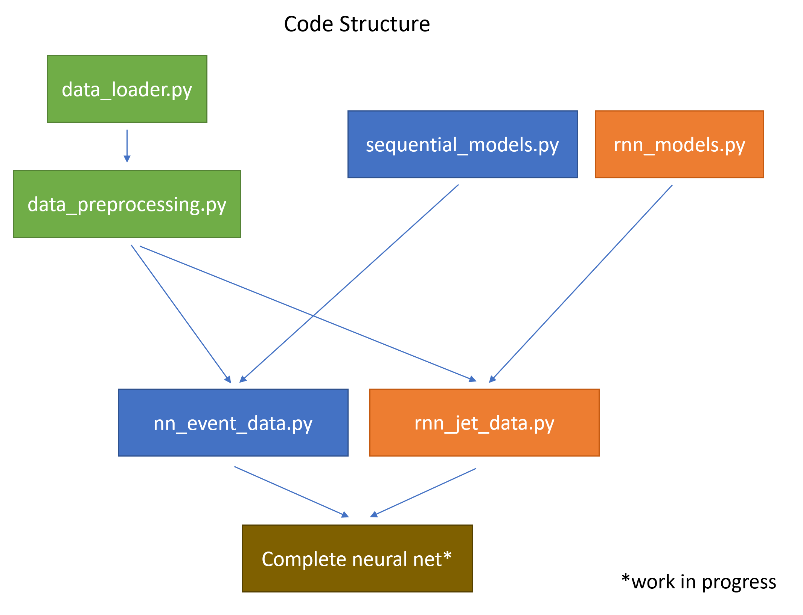

# invisible-higgs
Repository for 2020/2021 Physics MSci project "Searches for new physics at the LHC using machine learning" .

# Structure
This repository is currently structured as follows.

    ├── Images
        └── ....
    ├── dice_scripts
        └── ....
    ├── src            
        ├── models   
        │   ├── recurrent_models.py
        │   └── sequential_models.py
        ├──notebooks
            ├── dataset_exploration.ipynb
            └── neural_network_results.ipynb
        ├── tuning 
        │   ├── nn_events_hyperparameter_tuning.ipynb
        │   └── nn_multifeature_tuning.py
        ├── utilities   
        │   ├── data_loader.py
        │   ├── data_preprocessing.py
        │   └── plotlib.py
        ├── complete_neural_network.py
        ├── hist_plt.py
        ├── multi_classification_complete_network.py
        ├── multi_classification_nn.py
        ├── multi_classification_rnn.py
        ├── nn_event_data.py
        ├── preprocess_data.py
        └── rnn_jet_data.py
    

